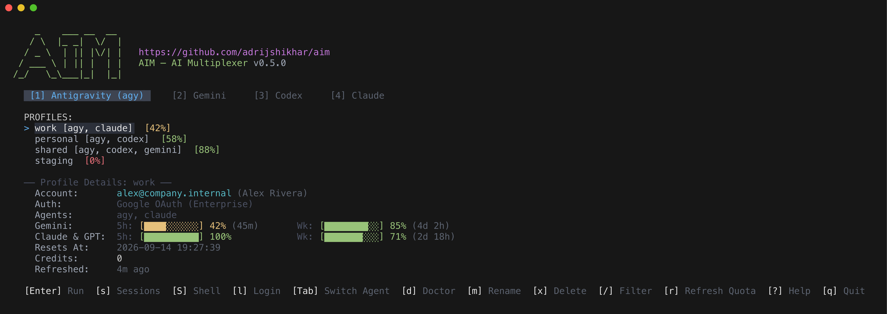
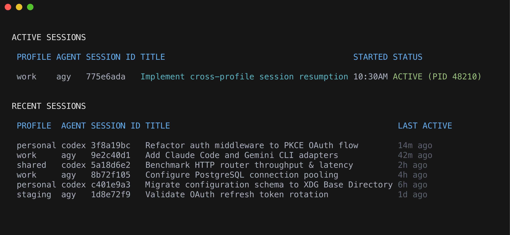
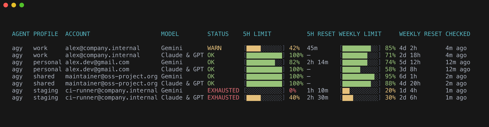
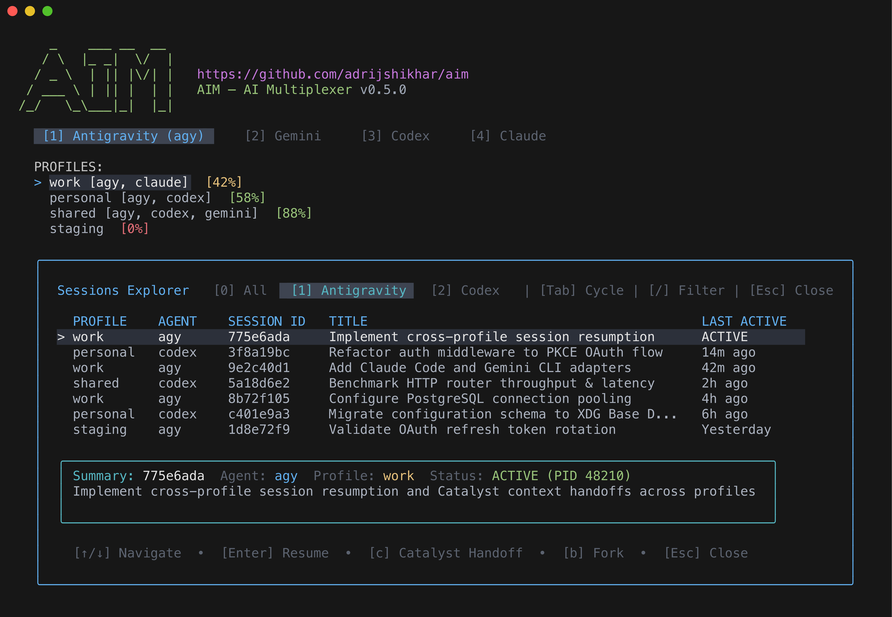

# aim — AI Multiplexer

`aim` is a lightweight CLI and TUI for multiplexing multiple AI coding assistants (Antigravity, Gemini, Claude Code, Codex…) under fully isolated profiles with real-time quota telemetry.

Each profile gets its own sandboxed virtual home directory — separate credentials, history, and state — so you can switch between `work` and `personal` accounts seamlessly.

<p align="center">
  
</p>

```bash
aim                      # open the interactive TUI dashboard
aim run agy work         # run Antigravity under the "work" profile
aim run codex personal   # run Codex under the "personal" profile
aim usage agy            # check quota capacity and reset timers across accounts
aim doctor               # diagnose binaries, tokens, and dotfile health
```

---

## Features

| Feature | Details |
|---|---|
| **Profile isolation** | Full virtual-home sandbox per profile — separate `~`, config, tokens, history |
| **Agent-aware profiles** | Profiles are tagged per agent; `aim list agy` shows only Antigravity profiles |
| **Multi-agent support** | Antigravity CLI (`agy`), Gemini CLI (`gemini`), and OpenAI Codex (`codex`) out of the box; easily extensible |
| **Interactive TUI** | Bubble Tea dashboard with real-time capacity gauges, multi-agent tabs (`1`–`4`, `Tab`), live fuzzy filter (`/`), help overlay (`?`), and one-key launch |
| **XDG Base Directory** | Follows XDG standards (`~/.config/aim`, `~/.local/state/aim`, etc.) with seamless legacy `~/.aim` fallback |
| **Keychain isolation** | System keychains mounted for developer tools (`gh`, `git`); agent tokens explicitly purged |
| **Debug logging** | Opt-in tracing via `--debug`, `AIM_DEBUG=1`, or config file with dual console/file logs |
| **Usage & quota tracking** | Live capacity gauges, 5h & weekly limits, reset countdowns, and instant caching |
| **OAuth PKCE login** | `aim login agy work` completes OAuth in browser and isolates the token |
| **Shell completions** | Tab-complete agents, profiles, and subcommands in zsh, bash, and fish |
| **Doctor command** | Diagnoses missing binaries, tokens, ADC status, and keychain isolation |
| **Session resumption & handoffs** | Browse history across profiles (`aim sessions` or `s` in TUI), resume verbatim, or hand off context with Catalyst |

---

## Installation

### Homebrew (Recommended for macOS & Linux)

The easiest way to install and stay up to date:

```bash
brew tap adrijshikhar/homebrew-tap
brew install --cask aim
```

*Or via single command:*
```bash
brew install --cask adrijshikhar/tap/aim
```

To update to future releases:
```bash
brew update && brew upgrade adrijshikhar/tap/aim
```

> [!TIP]
> **macOS Gatekeeper Safe**: Installing via Homebrew automatically manages permissions and clears the quarantine flag (`com.apple.quarantine`), so `aim` runs without "unidentified developer" security warnings.

### Quick Install (Script)

```bash
curl -fsSL https://raw.githubusercontent.com/adrijshikhar/aim/main/install.sh | sh
```

### Pre-Compiled Binaries & Source
Download standalone archives from [GitHub Releases](https://github.com/adrijshikhar/aim/releases/latest), or build from source with Go 1.23+:
```bash
git clone https://github.com/adrijshikhar/aim.git && cd aim && make install
```

*(If downloading standalone archives directly in a macOS web browser, run `xattr -d com.apple.quarantine $(which aim)` to clear Gatekeeper warnings).*

---

## CLI Cheatsheet

| Command | Description |
|---|---|
| `aim` | Open the interactive TUI dashboard (default) |
| `aim run <agent> <profile> [-- args...]` | Execute an agent under an isolated profile |
| `aim sessions [agent] [--active] [--json]` | List active and past conversation sessions across profiles & host |
| `aim sessions show [agent] <id>` | Show detailed preview card, goal summary, and metadata for a session |
| `aim resume <agent> <profile> [id] [-- args...]` | Resume conversation verbatim (`--exact`) or via Catalyst (`--catalyst`); pass flags via `--` |
| `aim sessions import <agent> <profile> [id]`| Import or hydrate conversation from host into profile (`--all`, `--fork`) |
| `aim usage [agent] [profile] [-r] [--json]` | Display remaining quota, reset timers, and credits |
| `aim list [agent]` | List all configured profiles and inline quota badges |
| `aim login <agent> <profile>` | Authenticate a new account via OAuth PKCE |
| `aim whoami` | Show active profile, agent, session ID, and quota info |
| `aim doctor [agent]` | Check environment, binary paths, tokens, ADC status, and keychain isolation |
| `aim shell <agent> <profile>` | Launch an isolated subshell with profile environment |
| `aim clone <agent> <src> <dst>` | Duplicate profile settings without copying tokens |
| `aim remove [agent] <profile>` | Unlink agent from profile (deletes dir if empty) |
| `aim completion <shell>` | Generate shell completions (`zsh`, `bash`, `fish`) |
| `aim --debug <command>` | Run any command with verbose debug tracing |

### Active & Recent Sessions Tracking

Track active terminal sessions and recent conversations across profiles and host with `aim sessions`:

<p align="center">
  
</p>

### Real-Time Multi-Agent Quota Telemetry

Inspect quota limits, live capacity gauges, reset countdowns, and status warnings across all accounts and models with `aim usage`:

<p align="center">
  
</p>

---

## TUI Keybindings

When running `aim`, navigate using the following shortcuts:

| Key | Action |
|---|---|
| `↑` / `k`, `↓` / `j` | Navigate profile list |
| `Enter` | Launch selected profile in terminal |
| `s` | Open Sessions Explorer drawer (navigate, resume exact, or catalyst handoff) |
| `S` / `$` | Open isolated subshell |
| `Tab` / `Shift+Tab` | Cycle agent tabs forward / backward |
| `1` – `3` | Switch directly to agent tab (`[1] Antigravity`, `[2] Gemini`, `[3] Codex`) |
| `/` | Live fuzzy profile filter (by profile or agent name) |
| `Esc` | Clear filter or dismiss open modal / drawer |
| `?` | Toggle contextual keyboard help overlay |
| `m` / `R` | Rename selected profile |
| `x` / `Delete` | Delete / unlink selected profile (with confirmation modal) |
| `d` | Toggle doctor diagnostics drawer |
| `r` | Refresh quota and limits |
| `q` / `Ctrl+C` | Quit dashboard |

---

## Session Resumption & Context Handoffs with Catalyst

`aim` tracks active and past sessions across isolated profiles and the host environment (`aim sessions` or press `s` in the TUI). It integrates with **[Catalyst](https://github.com/adrijshikhar/catalyst)** for structured, token-efficient context handoffs across profiles and sessions:

<p align="center">
  
</p>

- **Exact Resume (`Enter` / `--exact`)**: Reopens the session with its full verbatim conversation history intact.
- **Catalyst Handoff (`c` / `--catalyst`)**: Distills the session's goal, key decisions, and notes into a structured Handoff Brief (`.catalyst/handoffs/<branch>.json`). When resuming work on another profile or agent, AIM ingests this brief to continue work with a fresh context window without token bloat.

Special thanks and credit to **[Catalyst](https://github.com/adrijshikhar/catalyst)** for the handoff protocol specification. Be sure to check out the Catalyst project!

---

## Documentation

- 📖 **[Wiki & Architecture Guide](wiki.md)** — In-depth guide to virtual home isolation, dotfile bridging rules, directory structures, and configuration schemas.
- 🩺 **[Troubleshooting Guide](TROUBLESHOOTING.md)** — Actionable solutions for OAuth refresh tokens, cross-profile session resumption, SQLite migrations, and sidecar proxies.
- 🎨 **[Design System](design.md)** — Atom One Dark color palette, design tokens, typography, and Lipgloss implementation standards.
- 🛠️ **[Contributing Guide](CONTRIBUTING.md)** — Local development setup, test suite execution (`make test`, `make smoke`), and how to add new agent adapters.

---

## License

[MIT](LICENSE)
