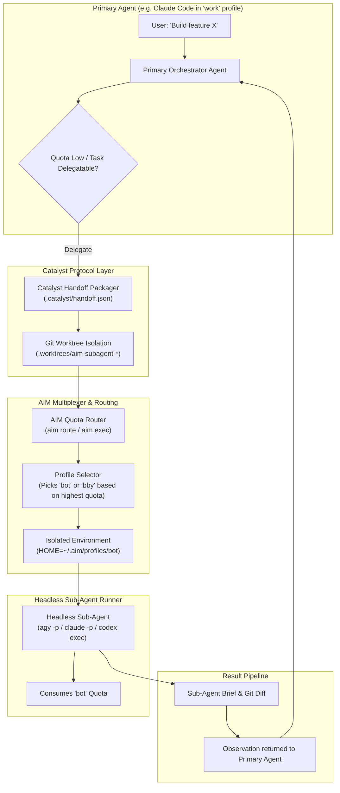

# AIM (AI Multiplexer) Product Roadmap

## Vision
AIM began as an isolated profile manager for human developers juggling multiple accounts across AI coding agents like Antigravity (`agy`), Claude Code, Codex, and Gemini. 

The next frontier transforms AIM into the **Agentic Identity & Quota Virtualization Engine**—enabling primary agents to seamlessly spawn headless sub-agents under alternate profiles, pool and route quotas dynamically, and delegate long-running tasks without losing context or exhausting rate limits.

---

## Architecture: Autonomous Multi-Agent Bursting via Catalyst



---

## Key Pillars

### 1. Headless Sub-Agent Execution (`aim exec`)
* **Non-Interactive Execution:** Primitives for running agents headlessly with a prompt string, stdin pipe, or Catalyst brief file:
  ```bash
  aim exec <agent> <profile> [prompt] [flags]
  ```
  * Example:
    ```bash
    aim exec agy bot "Implement unit tests for auth module" \
      --brief .catalyst/briefs/task-101.json \
      --timeout 15m \
      --json
    ```
* **Structured Output Contract:** Returns machine-readable JSON:
  ```json
  {
    "exit_code": 0,
    "agent": "agy",
    "profile": "bot",
    "session_id": "8f3b12a9",
    "duration_seconds": 42.5,
    "quota_consumed": "5h: -4%",
    "output": "Generated 4 test suites with 98% coverage...",
    "artifacts": [".catalyst/results/task-101-summary.md"]
  }
  ```

### 2. Smart Quota Routing (`aim route`)
* Instead of the caller agent guessing which profile has tokens, AIM dynamically evaluates cached and live limits:
  ```bash
  aim route agy --min-5h 20%
  # Returns: "bby" (bby has 83% weekly, 100% 5h)
  ```
* Supports `--least-used` and `--round-robin` balancing across multiple accounts for high-throughput batch workloads.

### 3. Catalyst Protocol Integration
* **Typed Task Briefs:** Uses Catalyst's `.catalyst/handoff.json` format to package:
  * Task description and acceptance criteria.
  * Active file context and recent git diffs.
  * Architecture decisions and constraints.
* **Catalyst Agent Skills & Hooks:**
  * Agents running inside Catalyst can invoke `/catalyst:subagent <task>` or call an AIM MCP server tool directly.
  * `on_quota_warning` hook: When the primary agent hits 10% remaining limit, Catalyst auto-packages context and delegates subsequent steps to an alternate profile.

### 4. Workspace & Git Worktree Concurrency Safety
* To prevent two agents from modifying the same files concurrently:
  * `aim exec --worktree`: Automatically creates a git worktree (`.worktrees/aim-subagent-<id>`).
  * The sub-agent commits changes to a branch (`aim/task-<id>`).
  * On completion, AIM provides the parent agent with the branch name and patch diff ready for inspection and merge.

---

## Roadmap Phases

### Phase 1: Core Isolation, TUI & CLI Modernization (Completed)
- [x] Multi-agent profile filesystem isolation (`~/.aim/profiles/<name>`).
- [x] Atom One Dark TUI dashboard with live quota tables and diagnostics.
- [x] Migration to `spf13/cobra` with native autocompletion (zsh, bash, fish).
- [x] Direct desktop browser launching and OAuth token auto-repair.
- [x] `aim whoami` / `aim current` session introspection with human-readable chat titles.
- [x] Automatic terminal window/tab title synchronization.

---

### Phase 2: Headless Execution & Catalyst Integration (Upcoming)
- [ ] **`aim exec` Subcommand:**
  - Non-interactive execution harness for `agy`, `claude`, `codex`, `gemini`.
  - Structured stdout/JSON output mode (`--json`).
  - Timeout enforcement and process cancellation.
- [ ] **Catalyst Integration Layer:**
  - Ingest and emit Catalyst typed handoff briefs (`.catalyst/handoff.json`).
  - Native Catalyst skill/command (`/catalyst:burst`, `/catalyst:subagent`).
- [ ] **Smart Quota Router (`aim route`):**
  - Query best profile by remaining quota and model capability.
  - Auto-bursting policy configuration in `config.json`.
- [ ] **Git Worktree Isolation (`--worktree`):**
  - Safe concurrent editing in isolated branch worktrees.

---

### Phase 3: Sessions Management & Cross-Profile Resumption
- [ ] **`aim sessions` Subcommand:**
  - Chronological chat session explorer with titles, short session IDs, and profile tags.
- [ ] **`aim resume <agent> <profile> [session-id]`:**
  - Resume existing chat sessions across any profile using bridged conversation state.
  - Interactive conversation picker in TUI (`[s] Sessions Drawer`).
- [ ] **Session Lifecycle Hooks:**
  - Auto-archive dormant sessions and clean orphaned `.lock` files.

---

### Phase 4: Autonomous Squad Pooling & Distributed Agents
- [ ] **AIM MCP Server:**
  - First-class Model Context Protocol (MCP) server exposing `spawn_subagent`, `check_quota`, and `list_profiles` as standard agent tools.
- [ ] **Multi-Agent Pool Management:**
  - Run concurrent worker squads across 5+ accounts in parallel (e.g. running test suites, documentation sweeps, and lint fixes simultaneously).
- [ ] **Quota Usage Analytics & Alerts:**
  - Historical burn rate graphs and desktop notifications when accounts reset.
